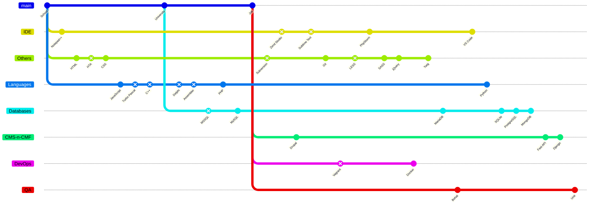

## About me

Experienced Full-stack Developer with over 10 years of practical experience.
Focused on creating effective and scalable solutions that meet clients' and
businesses' requirements. Significant experience in back-end development of web
applications.

## Tech stack

